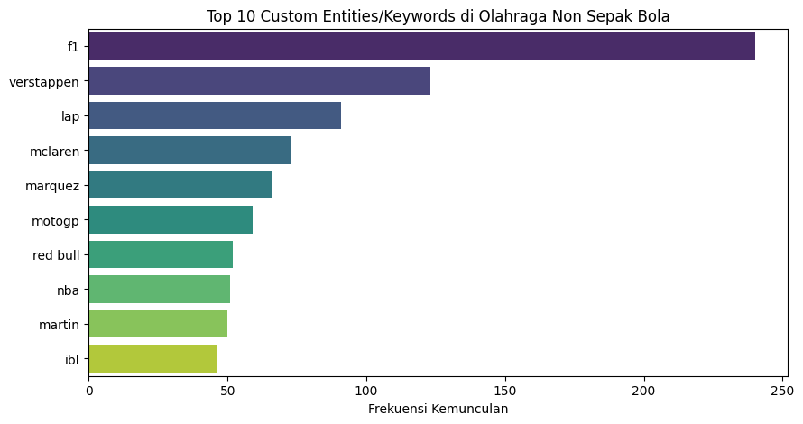

# Multiclass-Text-Classification-Football-League-News

## Summary
This project focuses on building a multiclass text classification model from scratch, starting with independent data collection via web scraping. The trained model automatically predicts and categorizes digital news texts into five specific sports categories.

## Problem
1. **Lack of Dataset:** There was no ready-to-use dataset available, requiring custom web scraping to collect a minimum of 100 digital news texts from at least two different media outlets.
2. **Automated Categorization:** The system needed to accurately classify news texts into 5 distinct labels: Non-soccer Sports, English League, Indonesian League, Spanish League, and Italian League.

## Methodology
1. **Web Scraping:** Extracted and collected news text data directly from digital media platforms as the initial data acquisition step.
2. **Manual Labeling:** Performed manual classification labeling on the scraped text data to assign them into the 5 predefined sports categories.
3. **Modeling & Evaluation:** Trained classification models (including a 2-stage model architecture) and compared their performance. Evaluated metrics based on validation loss and F1-score.
4. **Configuration Experimentation:** Analyzed the stability of training performance by comparing approaches with and without hyperparameter tuning.

## Skills
1. **Python:** Pandas, Numpy
2. **Data Collection:** Web Scraping (Digital Text Extraction)
3. **Machine Learning / NLP:** Text Classification, Hyperparameter Tuning, Model Evaluation (Validation Loss, F1-Score)

## Results
1. **Loss vs. F1-Score Dynamics:** Discovered that a decrease in validation loss did not linearly correlate with an increase in the F1-score during the text modeling validation.
2. **2-Stage Model Stability:** The 2-stage model configuration without any hyperparameter tuning unexpectedly proved to be the most stable and accurate classification approach.
3. **Training Efficiency:** Results demonstrated that a more conservative training strategy—characterized by a smaller learning rate and shorter training duration—was highly effective in achieving optimal generalization and preventing overfitting.

## Next Steps
1. **Scale Data Volume:** Scrape news texts on a much more massive scale to improve the model's future generalization capabilities.
2. **Advanced Architecture Experiments:** Evaluate other algorithms beyond the conservative 2-stage model approach to increase multiclass accuracy.
